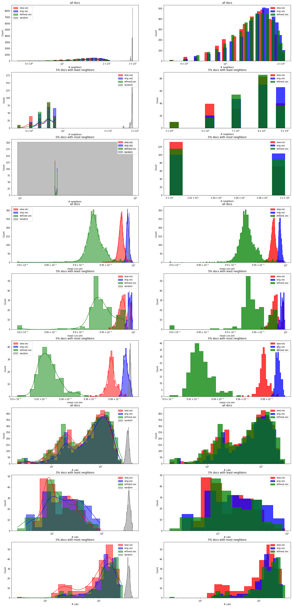
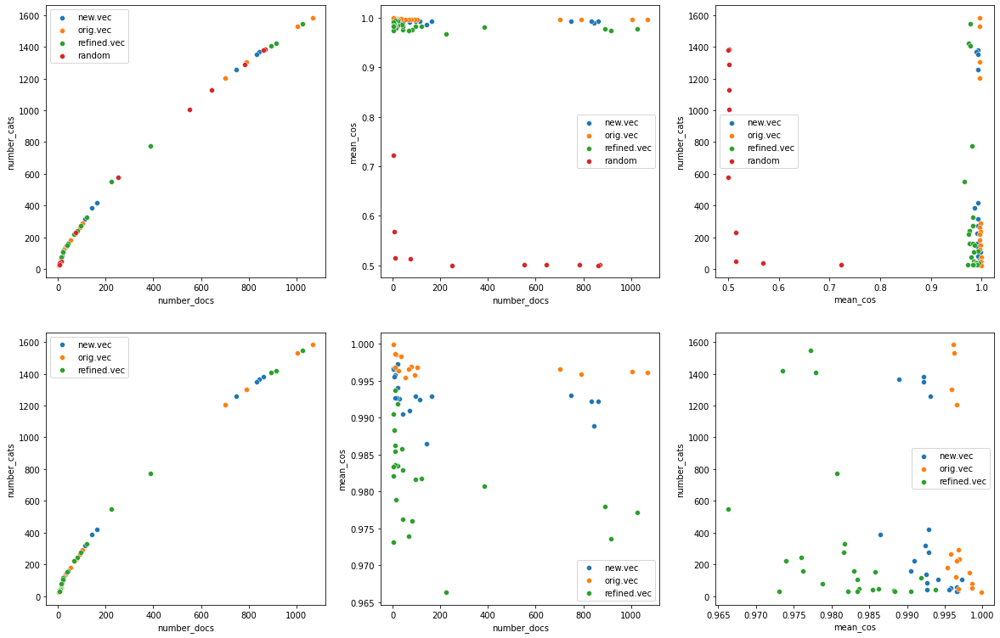
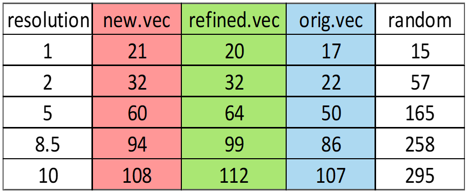
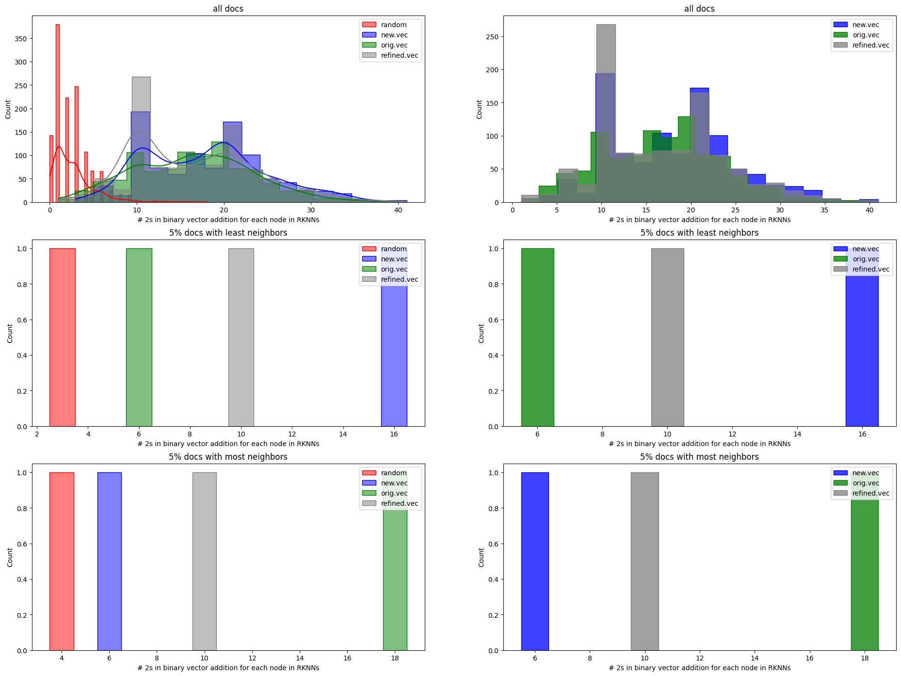

# KNN Diagnosis Tool for Embedding Comparison

A tool to **distinguish and compare different embeddings** of the same corpus using **K-Nearest Neighbors (KNN) graphs** and derived features. This project helps select the optimal embedding model for a given task by analyzing feature correlations with performance.

📄 **[Full Report](Final-Report-Behnam_Fanitabasi.pdf)**

---

## 📌 Overview
Neural natural language models are increasingly important for interpreting human text. However, selecting the best model for a specific task is challenging. This tool **compares multiple embeddings** of the same corpus by deriving and analyzing features from **KNN graphs** and **recursive KNN graphs**.

---

## 📥 Input Format
The tool accepts the following input files (see the `Input` folder for examples):
- **Documents**: A `.txt` file where each line represents a document.
- **Labels** (optional): A `.txt` file where each line represents the label of the corresponding document. Labels can be keywords or omitted.
- **Embeddings**: `.txt` or `.pickle` files where each line represents the embedding of a document (stored as `numpy.array`).

### Optional External Files
- **TF-IDF values**: A `.csv` file of unique TF-IDF values for labels.
- **Hamming Distance Matrix**: A dataframe where element `(i,j)` is the Hamming distance between document `i` and `j` based on label characteristic vectors. The tool can also calculate these matrices for you.

---

## ✨ Features
The tool constructs **KNN graphs** using **cosine similarity** or **L2 norm** and derives the following features from **recursive KNN graphs** (defined by the `nHops` parameter):
- **Number of neighbors** across all levels of each node.
- **Mean cosine similarity** across all levels of each node.
- **Number of categories** across all levels of each node.

### Community Detection
- Uses **NetworkX** to detect communities in the KNN graph:
  ```python
  networkx.greedy_modularity_communities(G, weight=similarity, resolution=1, cutoff=1, best_n=None)
  ```
  ([NetworkX Documentation](https://networkx.org/documentation/stable/reference/algorithms/generated/networkx.algorithms.community.modularity_max.greedy_modularity_communities.html#rce363827c0a4-2))

- Investigates **subgraphs** and **dense clusters** for additional insights.

---

## 📊 Results
The tool was tested on a sample of the **[Amazon Cat-13k dataset](http://manikvarma.org/downloads/XC/XMLRepository.html)** using three different embedding models.

### Feature Distributions

*Histograms show the ability of each feature to distinguish between embeddings.*

### Community Analysis

*Scatter plots of communities in different KNN graphs.*

### Score Plots


*Scores represent the average number of common labels between nodes and their K neighbors in the KNN environment.*

---

## 🔍 Key Findings
- **Mean cosine similarity** is the most effective feature for distinguishing between embeddings.
- Different embeddings yield a **varying number of communities**, providing insights for future model training and scoring methods.
